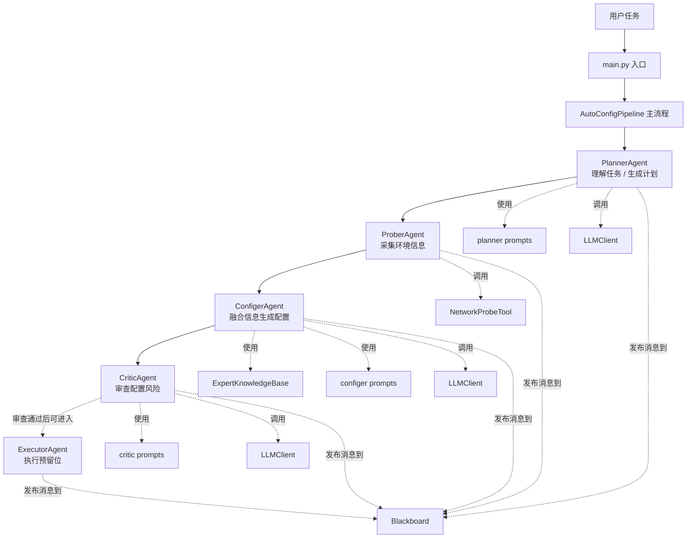
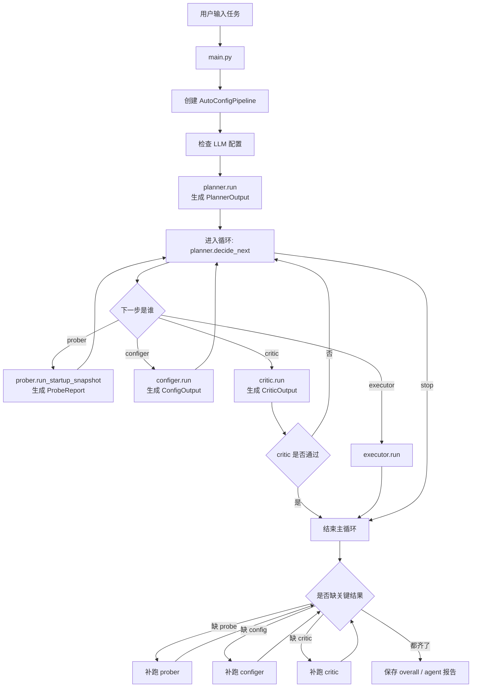

# 框架总流程

## 整体流程

项目的主线可以概括成一句话：

`用户任务 -> planner 理解需求 -> prober 收集环境 -> configer 生成配置 -> critic 审查结果`

如果把它理解成团队协作，可以这样看：

- `planner` 像项目经理，先把需求拆清楚
- `prober` 像现场勘察员，去看机器和网络情况
- `configer` 像方案设计师，综合信息给出配置方案
- `critic` 像审核员，判断这个方案是否稳妥
- `pipeline` 像总调度，把这些角色按顺序组织起来

## 模块说明

### 1. 入口层

#### `main.py`

这是命令行入口。

它的职责很简单：

- 读取命令行参数
- 拿到用户任务描述
- 创建 `AutoConfigPipeline`
- 执行主流程
- 把最终结果打印出来并写入文件

你可以把它理解成“启动按钮”。

### 2. 数据结构层

#### `autopriv/types.py`

这个文件定义了项目里最重要的数据对象。它的作用是把各模块之间传递的信息标准化。

最常见的几个对象：

- `PlannerOutput`：planner 的输出，包含目标、约束和探测计划
- `ProbeOutput`：单次探测结果
- `ProbeReport`：多次探测后的完整报告
- `ConfigOutput`：最终配置建议
- `CriticOutput`：critic 的审查结果
- `ExecutorOutput`：executor 的执行结果
- `AgentMessage`：黑板上的通信消息

可以把 `types.py` 理解成“项目内部统一表单”。

### 3. agent 层

#### `autopriv/agents/base.py`

定义所有 agent 的共同基类。它只做两件事：

- 给 agent 一个名字
- 给 agent 一个统一的 `run()` 接口

它像一个最基础的模板。

#### `autopriv/agents/planner.py`

`planner` 是整个系统的起点，也是调度的核心。

它分成两个主要动作：

- `run()`：先理解用户任务，生成初始计划
- `decide_next()`：根据当前状态和最新观察，决定下一步让哪个 agent 工作

它依赖大模型输出 JSON，所以它更像“大脑”而不是执行器。

planner 产出的重点信息有三类：

- `goals`：这次任务想达到什么目标
- `constraints`：有哪些限制，比如偏好哪个后端
- `probe_plan`：准备怎么探测环境

#### `autopriv/agents/prober.py`

`prober` 负责收集本地环境信息。

当前它真正采集的内容只有四类：

- 网络 RTT
- 近似带宽
- CPU 核数
- 物理内存

它支持两种方式：

- `run_once()`：采集一次
- `run_periodic()`：采集多次并汇总

在项目启动阶段，通常用的是 `run_startup_snapshot()`。这个方法会根据 planner 提供的计划，决定启动时采样一次还是采样多次。

#### `autopriv/agents/configer.py`

`configer` 负责生成配置建议，是整个系统里“融合信息”最明显的模块。

它会综合四类输入：

- planner 提供的目标与约束
- prober 采集到的机器和网络信息
- 专家规则库中的命中规则
- 大模型的二次细化判断

它最终输出：

- `backend`
- `mode`
- `parallelism`
- `profile`
- `notes`

简单理解就是：先用代码规则给一个默认方案，再让知识库和大模型一起把方案修正得更像“可用配置”。

#### `autopriv/agents/critic.py`

`critic` 是审查员。

它会检查两类问题：

- 代码里写死的静态规则问题
- 大模型给出的风险判断

它的输出重点不是“生成方案”，而是回答这几个问题：

- 现在这个配置能不能通过
- 风险高不高
- 有哪些问题
- 下一步应该找谁继续处理

#### `autopriv/agents/executor.py`

`executor` 是执行预留位。

当前代码里已经有两个方向：

- `secretflow`：可以尝试运行指定脚本
- `mp-spdz`：目前只返回“尚未实现”

因此它目前更像“未来准备接入真实执行”的接口，而不是已经完全打通的生产执行模块。

### 4. 编排层

#### `autopriv/orchestration/pipeline.py`

这是项目最关键的组织者。

它负责：

- 初始化全部 agent
- 维护流程状态
- 让 planner 决定下一步
- 调用对应 agent
- 记录消息
- 保存最终结果

#### `autopriv/orchestration/blackboard.py`

这是流程中的消息记录器。

它不负责计算，只负责存消息，让系统知道“谁在什么时候说了什么”。

### 5. 支撑模块

#### `autopriv/tools/base.py`

定义工具接口和工具注册表。它相当于“工具箱管理器”。

#### `autopriv/tools/network.py`

当前唯一的探测工具，用来测试网络 RTT、带宽，并读取 CPU 和内存。

#### `autopriv/knowledge/expert_kb.py`

这是一个轻量规则知识库，不是向量数据库。

它会读取 `expert_rules.json`，然后根据当前任务偏好和探测结果做简单匹配，返回命中的规则。

#### `autopriv/knowledge/expert_rules.json`

这里保存具体规则，例如：

- 高 RTT 时偏向离线预计算
- 低带宽时偏向低带宽配置
- 用户明确偏好 SecretFlow 时直接保留这个偏好

#### `autopriv/llm/client.py`

这是大模型调用封装层。

它负责：

- 检查环境变量是否齐全
- 向兼容 OpenAI `chat/completions` 的接口发请求
- 要求模型返回 JSON
- 把返回结果解析成 Python 字典

#### `autopriv/prompting/prompt_store.py`

负责读取 prompt 模板，并用变量替换占位符。

#### `autopriv/prompts/*.txt`

这里是各 agent 使用的提示词模板：

- planner 的任务理解 prompt
- planner 的下一步决策 prompt
- configer 的配置细化 prompt
- critic 的审查 prompt
- prober 的默认说明 prompt

#### `autopriv/memory/episode_memory.py`

这是一个简单的运行记忆模块，可以把一次会话结果追加保存成 JSONL。

当前主流程里还没有深度接入它，所以可以把它理解成“可扩展的历史记录能力”。


## 真正驱动流程的核心文件

主流程在 `autopriv/orchestration/pipeline.py`。

它做了几件关键事情：

1. 创建所有 agent 实例
2. 先调用 `planner.run()` 生成初始计划
3. 维护一份当前状态 `state`
4. 反复调用 `planner.decide_next()`，让 planner 判断下一步该找谁
5. 根据返回结果，去执行 `prober`、`configer`、`critic` 或 `executor`
6. 把所有通信过程记录到 `blackboard`
7. 最后把结果统一保存成 JSON 和文本报告

## 数据是怎样流动的

一次典型运行里，数据会经历下面几个阶段：

1. 用户输入一句任务描述
2. `planner` 把它整理成 `goals`、`constraints` 和 `probe_plan`
3. `prober` 根据 `probe_plan` 生成 `probe_report`
4. `configer` 综合 `planner` 和 `probe` 结果，生成 `config`
5. `critic` 根据 `planner + probe_report + config` 给出 `approved` 和 `issues`
6. `pipeline` 把这些结果组合成总报告输出

这里最关键的是：每一步的输出，都会成为下一步的输入。

## 运行与输出

### 程序怎么启动

程序从 `main.py` 启动。

最常见的调用方式是：

```bash
conda run -n autopriv python main.py "请自动配置隐私计算任务，优先低延迟"
```

传入的核心信息只有一个，就是用户任务描述。

### 启动后发生了什么

程序启动后，大致会按下面顺序执行：

1. 读取参数
2. 加载环境变量和配置
3. 检查大模型配置是否完整
4. 创建 `AutoConfigPipeline`
5. 执行 planner、prober、configer、critic
6. 把结果保存到输出文件

### 运行依赖的配置

这个项目当前是 LLM 驱动的，因此如果没有下面几个环境变量，主流程会直接报错：

- `AUTOPRIV_LLM_API_KEY`
- `AUTOPRIV_LLM_BASE_URL`
- `AUTOPRIV_LLM_MODEL`

### 输出文件会写到哪里

默认会生成三类结果：

- 总报告
- 探测报告
- 配置结果

另外，`pipeline` 还会再拆出更细的 agent 子报告，方便单独查看。

典型输出包括：

- `examples/overall/overall_report.json`
- `examples/overall/overall_report.txt`
- `examples/agents/planner/planner_output.json`
- `examples/agents/prober/prober_output.json`
- `examples/agents/configer/configer_output.json`
- `examples/agents/critic/critic_output.json`

### 总报告里最值得看的字段

只想快速判断这次运行发生了什么，优先看总报告里的这些部分：

- `planner`：任务被怎样理解
- `probe_report.summary`：环境探测汇总
- `config`：最终配置建议
- `critic`：审查是否通过
- `actions`：planner 每一步的决策轨迹
- `messages`：各 agent 之间的通信记录

## 框架示意图

为了让这部分既容易看懂，又不和源码逻辑冲突，下面分成两张图来看：

- 第一张图：站在“概念设计”的角度看，各模块怎么协作
- 第二张图：站在“当前代码实现”的角度看，程序实际怎么跑

### 1. 按模块职责看的示意图



这张图表达的是“谁负责什么”：

- `main.py` 负责启动
- `pipeline` 负责调度
- `planner / prober / configer / critic / executor` 负责分工协作
- `tools / knowledge / prompts / llm / blackboard` 负责给这些 agent 提供支撑

### 2. 按当前代码执行顺序看的示意图



这张图更贴近真实代码逻辑，尤其要注意两点：

- `planner.decide_next()` 会反复决定下一步，不是写死只跑一次
- 当前 `pipeline.py` 中，一旦 `critic` 返回 `approved=True`，主循环就会先结束，所以默认流程通常停在 `critic`，`executor` 更像已接好的预留步骤，而不是每次都会自动执行

### 3. 数据流的简化示意图

如果只关心“数据是怎么传下去的”，可以看成下面这样：

```text
用户任务
  -> PlannerOutput
  -> ProbeReport / ProbeOutput
  -> ConfigOutput
  -> CriticOutput
  -> 总报告（overall_report）
```

对应到代码里就是：

- `planner` 负责把自然语言任务转成结构化计划
- `prober` 负责把本地环境转成结构化探测结果
- `configer` 负责把计划和环境结果转成结构化配置
- `critic` 负责把配置转成结构化审查结论
- `pipeline` 负责把这些对象汇总并写盘

